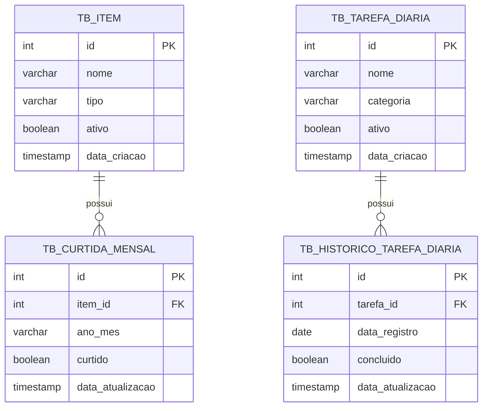

# Bitt Gamification Tracker

API REST para acompanhar hábitos diários e a interação mensal com conteúdos de gamificação. O sistema permite listar dicas e receitas, marcar ou desmarcar uma curtida em determinado mês, registrar a conclusão diária de tarefas e consultar o progresso mensal.

## Funcionalidades

- Importação de dicas e receitas em lote.
- Listagem de itens com o status de curtida de um mês.
- Alternância do status de curtida mensal de um item.
- Listagem de tarefas com o status de conclusão de uma data.
- Alternância do status de conclusão diária de uma tarefa.
- Resumo mensal de dicas e receitas curtidas.

## Tecnologias

- Java 21
- Spring Boot 3.4.1
- Spring Web e Bean Validation
- Spring Data JPA/Hibernate
- PostgreSQL
- Flyway
- Maven
- Lombok

## Arquitetura

O código está organizado em camadas:

```text
src/main/java/com/bitt/tracker
├── api/           # Controllers REST e tratamento global de erros
├── domain/        # Entidades JPA e enums
├── dto/           # Contratos de entrada e saída da API
├── repositories/  # Acesso ao banco com Spring Data JPA
└── services/      # Regras de negócio e transações
```

Fluxo de uma requisição:

```text
Cliente HTTP → Controller → Service → Repository → PostgreSQL
                                      ↑
                                 Entidades JPA
```

As migrations do banco ficam em `src/main/resources/db/migration` e são executadas automaticamente pelo Flyway na inicialização.

## Pré-requisitos

- JDK 21
- Maven 3.9 ou superior, ou um Maven Wrapper funcional
- PostgreSQL em execução
- Banco de dados chamado `bitt_tracker`

Exemplo de criação do banco com `psql`:

```sql
CREATE DATABASE bitt_tracker;
```

## Configuração

A configuração local atual está em `src/main/resources/application.yml`:

```yaml
spring:
  datasource:
    url: jdbc:postgresql://localhost:5432/bitt_tracker
    username: postgres
    password: admin
```

O Spring Boot permite sobrescrever esses valores por variáveis de ambiente. No PowerShell:

```powershell
$env:SPRING_DATASOURCE_URL = "jdbc:postgresql://localhost:5432/bitt_tracker"
$env:SPRING_DATASOURCE_USERNAME = "postgres"
$env:SPRING_DATASOURCE_PASSWORD = "sua-senha"
```

Não reutilize a senha presente no arquivo em ambientes compartilhados ou de produção. Nesses ambientes, mantenha as credenciais fora do repositório.

## Executando o projeto

Com Maven instalado:

```powershell
mvn clean spring-boot:run
```

Ou, quando o Maven Wrapper estiver funcional:

```powershell
.\mvnw.cmd clean spring-boot:run
```

A API usa por padrão `http://localhost:8080`. O Flyway aplica as migrations pendentes durante a inicialização, e o Hibernate valida se o schema corresponde às entidades.

## Endpoints

| Método | Rota | Descrição |
| --- | --- | --- |
| `POST` | `/api/itens/batch` | Importa dicas e receitas em lote |
| `GET` | `/api/itens?tipo={tipo}&anoMes={anoMes}` | Lista itens e o status de curtida no mês |
| `POST` | `/api/itens/{id}/toggle-curtida` | Alterna a curtida de um item no mês |
| `GET` | `/api/tarefas-diarias?data={data}` | Lista tarefas e o status na data |
| `POST` | `/api/tarefas-diarias/{id}/toggle-conclusao` | Alterna a conclusão de uma tarefa na data |
| `GET` | `/api/progresso/{anoMes}` | Retorna o progresso mensal |

Valores aceitos:

- `tipo`: `DICA` ou `RECEITA`.
- `categoria` de tarefa: `TREINO`, `CORRIDA`, `POSTAGEM`, `AGUA` ou `OUTRO`.
- `anoMes`: atualmente é uma string; use a convenção `AAAA-MM`, por exemplo `2026-09`.
- `data`: formato ISO `AAAA-MM-DD`, por exemplo `2026-09-01`.

A especificação completa, com corpos, respostas e exemplos, está em [docs/API.md](docs/API.md).

## Modelo de dados



As restrições únicas garantem no máximo uma curtida por item/mês e um histórico por tarefa/data.

## Carga de dados

Não há carga inicial de tarefas nas migrations. Para testar tarefas diárias, insira registros diretamente no banco:

```sql
INSERT INTO tb_tarefa_diaria (nome, categoria, ativo)
VALUES
    ('Beber água', 'AGUA', TRUE),
    ('Realizar treino', 'TREINO', TRUE);
```

Para dicas e receitas, prefira o endpoint de importação em lote. A pasta `scripts` contém utilitários auxiliares usados para extrair itens de um log e montar `payload-dicas.json`; esses scripts exigem Node.js e trabalham com caminhos relativos à própria pasta.

```powershell
cd scripts
node gerar-payload.js
```

## Testes

Execute:

```powershell
mvn test
```

O teste existente carrega o contexto completo do Spring e, com a configuração atual, depende de um PostgreSQL acessível e de um schema válido.

## Regras de negócio atuais

- O primeiro `toggle` cria o histórico com valor `true`; chamadas seguintes alternam entre `true` e `false`.
- A consulta de itens considera curtido apenas o registro mensal cujo valor seja `true`.
- O progresso mensal conta curtidas verdadeiras separadas por `DICA` e `RECEITA`.
- As metas retornadas pelo progresso são fixas em 25 dicas e 25 receitas.
- Os campos `ativo` existem no modelo, mas as consultas atuais não filtram registros inativos.

## Pontos de atenção

- As entidades `Item` e `TarefaDiaria` possuem `dataAtualizacao`, porém as migrations atuais de suas tabelas não criam `data_atualizacao`. Como `ddl-auto` está em `validate`, isso pode impedir a inicialização em um banco criado somente pelas migrations. A correção recomendada é uma nova migration, sem alterar migrations já aplicadas.
- `anoMes` ainda não possui validação do padrão `AAAA-MM`.
- O DTO de importação em lote não exige uma lista não vazia nem habilita a validação em cascata dos itens; entradas incompletas podem chegar à camada de serviço.
- A API ainda não possui autenticação, autorização, configuração explícita de CORS ou documentação OpenAPI/Swagger.
- Não há endpoint para cadastrar tarefas diárias; no estado atual elas precisam ser inseridas no banco.
- Os totais do progresso não são calculados a partir do cadastro de itens.

## Tratamento de erros

A API usa o formato `application/problem+json` do Spring (`ProblemDetail`) para recursos não encontrados, violações de regra de negócio e parâmetros com tipo inválido. Os principais códigos são:

- `200 OK`: consulta ou alternância realizada.
- `400 Bad Request`: corpo/parâmetro inválido ou regra de negócio violada.
- `404 Not Found`: item ou tarefa inexistente.

## Licença

O repositório não declara uma licença no estado atual.
